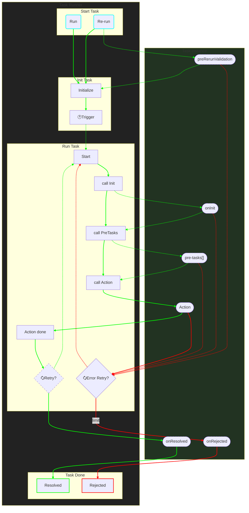

```mermaid
flowchart TB
    addTask --> initTask
    addTaskNow -.-> preRerunValidation -.-> initTask
    addTaskNow --> initTask
    initTask --> triggerTask
    triggerTask -.-> startTask
    startTask --> callInit --> callPreTasks --> callAction --> taskAction --> actionDone
    callInit -.-> onInit -.-> callPreTasks
    callPreTasks -.-> preTaskRunner -.-> callAction
    actionDone --> softRetry --> onResolved --> resolved
    softRetry -.-> startTask
    taskAction --> errorRetry -.-> startTask
    errorRetry --> |limit| onRejected --> rejected
    preTaskRunner -.-> errorRetry
    onInit -.-> errorRetry
    preRerunValidation -.-> errorRetry


    subgraph startState ["Start Task"]
        addTask("Run")
        addTaskNow("Re-run")
    end

    subgraph initState ["Init Task"]
        initTask["Initialize"]
        triggerTask["🕑Trigger"]
    end

    subgraph onBoxRetry ["&nbsp;"]
        softRetry{"🗘Retry?"}
        errorRetry{"🗘Error Retry?"}
    end

    subgraph runState ["Run Task"]
        startTask["Start"]
        callInit["call Init"]
        callPreTasks["call PreTasks"]
        callAction["call Action"]
        actionDone["Action done"]
        onBoxRetry
    end

    subgraph doneState ["Task Done"]
       resolved["Resolved"]
       rejected["Rejected"]
    end

    subgraph onBoxSolve ["&nbsp;"]
      onResolved(["onResolved"])
        onRejected(["onRejected"])
    end

    subgraph taskFunc ["Task instance"]
        preRerunValidation(["preRerunValidation"])
        onInit(["onInit"])
        preTaskRunner(["pre-tasks[]"])
        taskAction(["Action"])
        onBoxSolve
    end

    subgraph taskRunner ["Task Runner"]
        startState
        initState
        runState
        doneState
    end

    style preRerunValidation stroke-dasharray: 5 5
    style preTaskRunner stroke-dasharray: 5 5
    style onInit stroke-dasharray: 5 5
    style softRetry stroke-dasharray: 5 5
    style onResolved stroke-dasharray: 5 5
    style onRejected stroke-dasharray: 5 5
    style rejected stroke:#f00,stroke-width:2px
    style resolved stroke:#0f0,stroke-width:2px
    style addTask stroke:#0ff,stroke-width:2px
    style addTaskNow stroke:#0ff,stroke-width:2px
    style taskRunner fill:#222
    style taskFunc fill:#232
    style onBoxSolve fill:#232,stroke-width:0
    style onBoxRetry stroke-width:0
    linkStyle 0,1,2,3,4,5,6,7,8,9,10,11,12,13,14,15,16,17,18 stroke:#0f0,stroke-width:2px;
    linkStyle 19,20,21,22,23,24,25 stroke:#f00,stroke-width:2px;
```